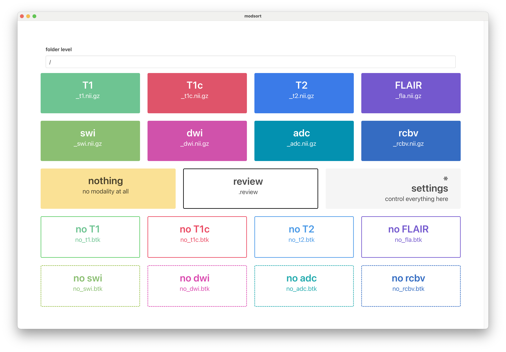

# modsort with vite and electron


**modsort** is a manual sorting tool for MR files, allowing you to organize them easily by dragging and dropping them into designated boxes.
Once sorted, the files are automatically copied and renamed to a relative location, ensuring consistency and eliminating typos.  

For efficiency, multiple files can be renamed at once using bulk mode.
After renaming, the files can be seamlessly preprocessed with the [preprocessing module](https://github.com/BrainLesion/preprocessing).  




## important commands
first run `cd modsort`
### installation
```
npm i
```

### dev
```
yarn dev
```
then use cmd + option + i to open console in the electron window

### build
```
yarn build --mac --win --linux
```

## citation
when using modsort please cite the BrainLesion suite paper:
```
tba
```
